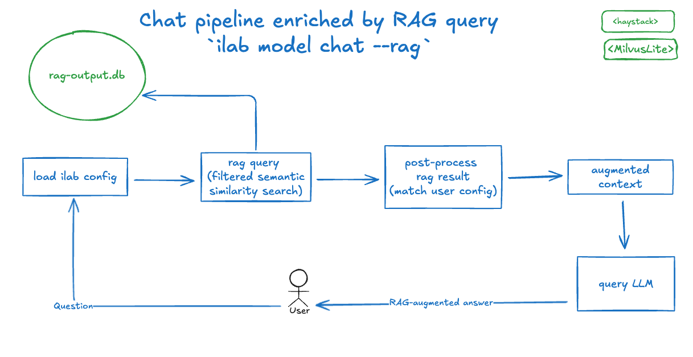

# Design Proposal - Embedding Ingestion Pipeline And RAG-Based Chat

**Author**: Daniele Martinoli

**Version**: 0.1

## 1. Introduction
This document proposes enhancements to the `ilab` CLI to support workflows utilizing Retrieval-Augmented Generation
(RAG) artifacts within `InstructLab`. The proposed changes introduce new commands and options for the embedding ingestion
and RAG-based chat pipelines:
* A new embedding ingestion command to process customer documentation, generate embeddings, and ingest them into a configured vector store.
* An option to enhance the chat pipeline by using the stored embeddings to augment the context of conversations, improving relevance and accuracy.

## 2. Proposed Commands
### 2.1 Working Assumption
This proposal aims to serve as a reference design to develop a Proof of Concept for RAG workflows, while
also laying the foundation for future implementations of state-of-the-art RAG artifacts tailored to specific use
cases.

To minimize impact on current and future users, the following boundaries are defined:
* Existing commands will only be updated to add flags or configurations that are maintainable in future versions.
  * Configuration parameters will be marked as `Optional` to not affect existing runtimes.
* New commands will be added using flags (e.g., `--abc`) or environment variables (e.g., `ILAB_ABC`) to avoid any configuration changes. 
  This approach ensures configuration compatibility even if the commands are deprecated later.

### 2.2 Embedding Ingestion Pipeline Command
The proposal is to add a `process`  command to the `data` command group, with an explicit `--rag` flag to trigger
the executions:
```
ilab data process --rag /path/to/docs/folder
```

The rationale behind this choice is that the `data process` command can support future workflows, making its
introduction an investment to anticipate other needs.

Since the RAG behavior is the only functionality of this new command, executions without the `--rag` option will result
in no output for now.

#### Command Purpose
Generate the embeddings from the documents at */path/to/docs/folder* folder and store them in the
configured vector database. These embeddings are intended to be used as augmented context in a RAG-based chat pipeline.

#### Assumptions
The provided documents must be in JSON format according to the InstructLab schema: this is the schema generated
when transforming knowledge documents with the `ilab data generate` command (see 
[Getting Started with Knowledge Contributions][1]).

To simplify the execution of the transformation step, we introduce a `--transform` option which also includes the documents
transformation, leveraging on the `instructlab-sdg` modules. 

### Why We Need It
This command streamlines the `ilab data generate` pipeline and eliminates the requirement to define a `qna` document,
which typically includes:
* A minimum of 5×3 question-and-answer pairs.
* Reference documents stored in Git.

The goal is not to generate training data for InstructLab-trained models but to utilize the documents for RAG 
workflows with pre-tuned models.

#### Supported Databases
The command may support various vector database types. A default configuration will align with the selected 
InstructLab technology stack.

### Local embedding models
The embedding model used to generate the text embeddings must be downloaded locally before executing the pipeline.

For example, this can be used to download the `sentence-transformers/all-minilm-l6-v2` model to the local models cache:
```bash
ilab model download -rp sentence-transformers/all-minilm-l6-v2
```

If the configured embedding model has not been cached, the execution will terminate with an error.

#### Usage
The generated embeddings can later be retrieved from a vector database and converted to text, enriching the 
context for RAG-based chat pipelines.

#### Defining Command Options
To maintain compatibility and simplicity, no new configurations will be introduced for this command. Instead,
the settings will be defined using the following hierarchy (options higher in the list overriding those below):
* CLI flags (e.g., `--rag`).
* Environment variables following a consistent naming convention, such as `ILAB_<UPPERCASE_ARGUMENT_NAME>`.
* Default values, for all the applicable use cases.

For example, the `vectordb-uri` argument can be implemented using the `click` module like this:
```py
@click.option(
    "--vectordb-uri",
    default='rag-output.db',
    envvar="ILAB_VECTORDB_URI",
)
```

### 2.3 Embedding Ingestion Pipeline Options

| Option Description | Default Value | CLI Flag | Environment Variable |
|--------------------|---------------|----------|----------------------|
| Whether to include a transformation step. | `False` | `--transform` (boolean) | `ILAB_TRANSFORM` |
| The output path of transformed documents (serve as input for the embedding ingestion pipeline). Mandatory when `--transform` is used. |  | `--transform-output` | `ILAB_TRANSFORM_OUTPUT` |
| Vector DB implementation, one of: `milvuslite`, **TBD** | `milvuslite` | `--vectordb-type` | `ILAB_VECTORDB_TYPE` |
| Vector DB service URI. | `./rag-output.db` | `--vectordb-uri` | `ILAB_VECTORDB_URI` |
| Vector DB collection name. | `IlabEmbeddings` | `--vectordb-collection-name` | `ILAB_VECTORDB_COLLECTION_NAME` |
| Vector DB connection username. | | `--vectordb-username` | `ILAB_VECTORDB_USERNAME` |
| Vector DB connection password. | | `--vectordb-password` | `ILAB_VECTORDB_PASSWORD` |
| Base directories where models are stored. | `$HOME/.cache/instructlab/models`  | `--model-dir` | `ILAB_MODEL_DIR` |
| Name of the embedding model. | **TBD** | `--embedding-model` | `ILAB_EMBEDDING_MODEL_NAME` |
| Token to download private models. |  | `--embedding-model-token` | `ILAB_EMBEDDING_MODEL_TOKEN` |

**TODO**: vector store authentication options.

### 2.4 RAG Chat Pipeline Command
The proposal is to add a `--rag` flag to the `model chat` command, like:
```
ilab model chat --rag
```

#### Command Purpose
This command enhances the existing `ilab model chat` functionality by integrating contextual information retrieved from user-provided documents, 
enriching the conversational experience with relevant insights.

#### Revised chat pipeline
* Start with the user's input, `user_query`.
* Use the given `user_query` to retrieve relevant contextual information from the embedding database (semantic search).
* Append the retrieved context to the original LLM request.
* Send the context augmented request to the LLM and return the response to the user.

### Local embedding models
Similar to the embedding ingestion pipeline, the embedding model required for generating text embeddings must be downloaded locally 
before running the pipeline.

### 2.5 RAG Chat Commands
The `/r` command may be added to the `ilab model chat` command to dynamically toggle the execution of the RAG pipeline.

The current status could be displayed with an additional marker on the chat status bar, as in (top right corner):
```console
>>> /h                                                                                                              [RAG][S][default]
╭───────────────────────────────────────────────────────────── system ──────────────────────────────────────────────────────────────╮
│ Help / TL;DR                                                                                                                      │
│                                                                                                                                   │
│  • /q: quit                                                                                                                       │
│  • /h: show help                                                                                                                  │
│  • /a assistant: amend assistant (i.e., model)                                                                                    │
│  • /c context: change context (available contexts: default, cli_helper)                                                           │
│  • /lc: list contexts                                                                                                             │
│  • /m: toggle multiline (for the next session only)                                                                               │
│  • /M: toggle multiline                                                                                                           │
│  • /n: new session                                                                                                                │
│  • /N: new session (ignoring loaded)                                                                                              │
│  • /d <int>: display previous response based on input, if passed 1 then previous, if 2 then second last response and so on.       │
│  • /p <int>: previous response in plain text based on input, if passed 1 then previous, if 2 then second last response and so on. │
│  • /r: toggle the status of the RAG pipeline.                                                                                     │
│  • /md <int>: previous response in Markdown based on input, if passed 1 then previous, if 2 then second last response and so on.  │
│  • /s filepath: save current session to filepath                                                                                  │
│  • /l filepath: load filepath and start a new session                                                                             │
│  • /L filepath: load filepath (permanently) and start a new session                                                               │
│                                                                                                                                   │
│ Press Alt (or Meta) and Enter or Esc Enter to end multiline input.                                                                │
╰───────────────────────────────────────────────────────────────────────────────────────────────────────────────────────────────────╯
```

### 2.6 RAG Chat Options
As we stated in [3.1 Working Assumptions](#31-working-assumption), we will introduce new configuration options for the spceific `chat` command,
but we'll use flags and environment variables for the options that come from the embedding ingestion pipeline command.

| Configuration FQN | Description | Default Value | CLI Flag | Environment Variable |
|-------------------|-------------|---------------|----------|----------------------|
| chat.rag.enabled | Enable or disable the RAG pipeline. | `false` | `--rag` (boolean)| `ILAB_CHAT_RAG_ENABLED` |
| chat.rag.retriever.top_k | The maximum number of documents to retrieve. | `10` | `--retriever-top-k` | `ILAB_CHAT_RAG_RETRIEVER_TOP_K` |
| chat.rag.prompt | Prompt template for RAG-based queries. | Examples below | `--rag-prompt` | `ILAB_CHAT_RAG_PROMPT` |
| | Vector DB implementation, one of: `milvuslite`, **TBD** | `milvuslite` | `--vectordb-type` | `ILAB_VECTORDB_TYPE` |
| | Vector DB service URI. | `./rag-output.db` | `--vectordb-uri` | `ILAB_VECTORDB_URI` |
| | Vector DB collection name. | `IlabEmbeddings` | `--vectordb-collection-name` | `ILAB_VECTORDB_COLLECTION_NAME` |
| | Vector DB connection username. | | `--vectordb-username` | `ILAB_VECTORDB_USERNAME` |
| | Vector DB connection password. | | `--vectordb-password` | `ILAB_VECTORDB_PASSWORD` |
| | Base directories where models are stored. | `$HOME/.cache/instructlab/models`  | `--model-dir` | `ILAB_MODEL_DIR` |
| | Name of the embedding model. | **TBD** | `--model` | `ILAB_EMBEDDING_MODEL_NAME` |
| | Token to download private models. |  | `--model-token` | `ILAB_EMBEDDING_MODEL_TOKEN` |

**TODO**: vector store authentication options.

Equivalent YAML document for the newly proposed options:
```yaml
chat:
  rag:
    enabled: false
    retriever:
      top_k: 10
    prompt: |
      Given the following information, answer the question.
      Context:
      {{context}}
      Question: {{question}}
      Answer:
```
**TODO**: unify prompt management in InstructLab

### 2.7 References
* [Haystack-DocumentSplitter](https://github.com/deepset-ai/haystack/blob/f0c3692cf2a86c69de8738d53af925500e8a5126/haystack/components/preprocessors/document_splitter.py#L55) is temporarily adopted with default settings  until a splitter based on the [docling chunkers][chunkers] is integrated
 in Haystack.
* [MilvusEmbeddingRetriever](https://github.com/milvus-io/milvus-haystack/blob/77b27de00c2f0278e28b434f4883853a959f5466/src/milvus_haystack/milvus_embedding_retriever.py#L18)


### 2.8 Workflow Visualization
<!-- https://excalidraw.com/#json=PN2h_LM-Wd2WZYBJfZMDs,WQCq5NDbRXUH2qr8maFFNg -->
Embedding ingestion pipeline:

RAG-based Chat pipeline:


### 2.9 Proposed Implementation Stack
> **ℹ️ Note:** This stack is still under review. The proposed list represents potential candidates based on the current state of discussions.

The following technologies form the foundation of the proposed solution:

* [Haystack](https://haystack.deepset.ai/): Framework for implementing RAG pipelines and applications.
* [MilvusLite](https://milvus.io/docs/milvus_lite.md): The default vector database for efficient storage and retrieval of embeddings.
* [Docling](https://github.com/DS4SD/docling): Document processing tool. For more details, refer to William’s blog, [Docling: The missing document processing companion for generative AI](https://www.redhat.com/en/blog/docling-missing-document-processing-companion-generative-ai).

## 3. Future Enhancements
### 3.1 Model Evaluation 
**TODO** A separate ADR will be defined.

### 3.2 Additional RAG chat steps
- [Ranking retriever's result][ranking]: 
```bash
ilab model chat --rag --ranking --ranking-top-k=5 --ranking-model=cross-encoder/ms-marco-MiniLM-L-12-v2
```
- [Query expansion][expansion]:
```bash
ilab model chat --rag --query-expansion --query-expansion-prompt="$QUERY_EXPANSION_PROMPT" --query-expansion-num-of-queries=5
```
- ...

### 3.3 Containerized Index
Generate a containerized RAG artifact to expose a `/query` endpoint:
```bash
ilab data process --rag --build-image --image-name=docker.io/user/my_rag_artifacts:1.0
```

[1]: https://github.com/instructlab/taxonomy?tab=readme-ov-file#getting-started-with-knowledge-contributions
[ranking]: https://docs.haystack.deepset.ai/v1.21/reference/ranker-api
[expansion]: https://haystack.deepset.ai/blog/query-expansion
[chunkers]: https://github.com/DS4SD/docling/blob/main/docs/concepts/chunking.md