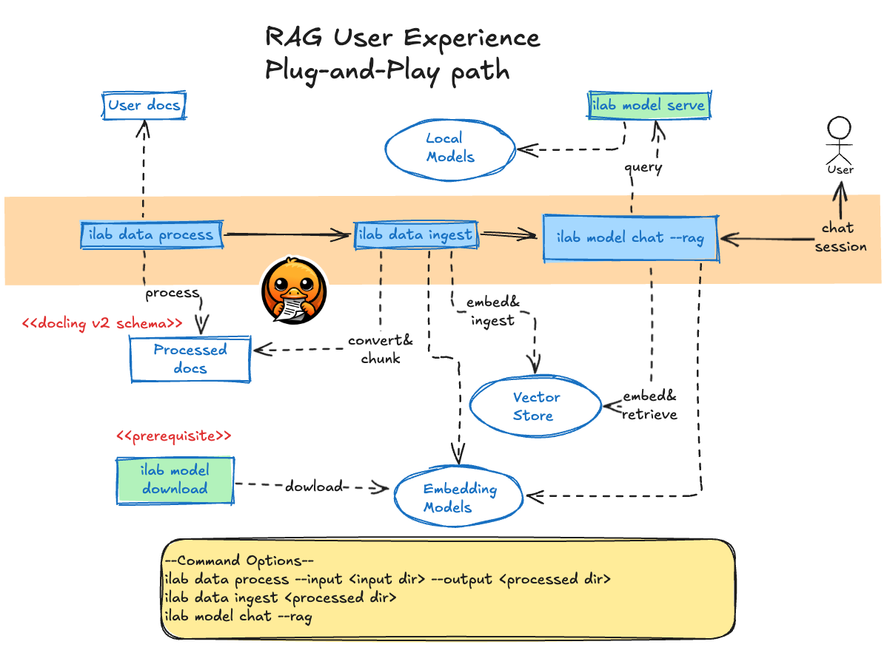

# Design Proposal - Embedding Ingestion Pipeline And RAG-Based Chat
**TODOs**: 
* Vector store authentication options.
* Document versioning and data update policies.
* Unify prompt management in InstructLab. See (`chat_template` [configuration][chat_template] and
`augment_chat_template` [function][augment_chat_template])

**Author**: Daniele Martinoli

**Version**: 0.1

## 1. Introduction
This document proposes enhancements to the `ilab` CLI to support workflows utilizing Retrieval-Augmented Generation
(RAG) artifacts within `InstructLab`. The proposed changes introduce new commands and options for the embedding ingestion
and RAG-based chat pipelines:
* A new `ilab data` sub-command to process customer documentation.
* A new `ilab data` sub-command to generate and ingest embeddings from pre-processed documents into a configured vector store.
* An option to enhance the chat pipeline by using the stored embeddings to augment the context of conversations, improving relevance and accuracy.

### 1.1 User Experience Overview
The commands are tailored to support diverse user experiences, all enabling the use of RAG functionality to enrich chat sessions.

### 1.2 Model Training Path
This flow is designed for users who aim to train their own models and leverage the source documents that support knowledge submissions to enhance the chat context:


**Note**: documents are processed using `instructlab-sdg` package and are defined using the docling v1 schema.

### 1.3 Tanomony Path (no Training)
This flow is for users who have defined taxonomy knowledge but prefer not to train their own models. Instead, they aim to generate RAG artifacts from source documents to enhance the chat context:


**Note**: documents are processed using `docling.DocumentConverter` and are defined using the docling v2 schema.

### 1.4 Plug-and-Play RAG Path
This flow is designed for users who want to enhance their chat experience with pre-trained models by simply integrating the RAG functionality:


**Note**: documents are processed using `docling.DocumentConverter` and are defined using the docling v2 schema.

## 2. Proposed Pipelines
### 2.1 Working Assumption
This proposal aims to serve as a reference design to develop a Proof of Concept for RAG workflows, while
also laying the foundation for future implementations of state-of-the-art RAG artifacts tailored to specific use
cases.

#### Command Options
To maintain compatibility and simplicity, no new configurations will be introduced for new commands. Instead,
the settings will be defined using the following hierarchy (options higher in the list overriding those below):
* CLI flags (e.g., `--FLAG`).
* Environment variables following a consistent naming convention, such as `ILAB_<UPPERCASE_ARGUMENT_NAME>`.
* Default values, for all the applicable use cases.

For example, the `vectordb-uri` argument can be implemented using the `click` module like this:
```py
@click.option(
    "--vectordb-uri",
    default='rag-output.db',
    envvar="ILAB_VECTORDB_URI",
)
```

#### Local embedding models
The embedding model used to generate text embeddings must be downloaded locally before executing the pipeline.

For example, this command can be used to download the `sentence-transformers/all-minilm-l6-v2` model to the local models cache:
```bash
ilab model download -rp sentence-transformers/all-minilm-l6-v2
```

If the configured embedding model has not been cached, the command execution will terminate with an error. This requirement applies
consistently to all new and updated commands.

### 2.2 Document Processing Pipeline
The proposal is to add a `process`  sub-command to the `data` command group:
```
ilab data process --input /path/to/docs/folder --output /path/to/processed/folder
```

#### Command Purpose
Applies the transformation for the customer documents in `/path/to/docs/folder`. Processed artifacts are stored under `/path/to/processed/folder`.

***Notes**: 
* In alignment with the current SDG implementation, the folder will not be navigated recursively. Only files located at the root level of the specified
folder will be considered. The same principle applies to all other options outlined below.
* To ensure consistency and avoid issues with document versioning or outdated artifacts, the destination folder will be cleared before execution. 
  This ensures it contains only the artifacts generated from the most recent run.

The trasformation is based on the `instructlab-sdg` modules (the initial step of the `ilab data generate` pipeline)

### Why We Need It
This command streamlines the `ilab data generate` pipeline and eliminates the requirement to define a `qna` document,
which typically includes:
* A minimum of 5×3 question-and-answer pairs.
* Reference documents stored in Git.

The goal is not to generate training data for InstructLab-trained models but to utilize the documents for RAG 
workflows with pre-tuned models.

#### Usage
The generated artifacts can later be used to generete and ingest the embeddings into a vector database.

### 2.3 Document Processing Pipeline Options


| Option Description | Default Value | CLI Flag | Environment Variable |
|--------------------|---------------|----------|----------------------|
| Base directories where models are stored. | `$HOME/.cache/instructlab/models`  | `--model-dir` | `ILAB_MODEL_DIR` |
| Name of the embedding model. | **TBD** | `--embedding-model` | `ILAB_EMBEDDING_MODEL_NAME` |

### 2.4 Embedding Ingestion Pipeline
The proposal is to add an `ingest` sub-command to the `data` command group:
```
ilab data ingest /path/to/docs/folder
```

#### Working Assumption
The documents at the specified path have already been processed using the `data process` command or an equivalent method
(see [Getting Started with Knowledge Contributions][ilab-knowledge]).

#### Command Purpose
Generate the embeddings from the pre-processed documents at */path/to/docs/folder* folder and store them in the
configured vector database.

**Notes**:
* To ensure consistency and avoid issues with document versioning or outdated embeddings, the ingested collection will be cleared before execution. 
  This ensures it contains only the embeddings generated from the most recent run.

### Why We Need It
To populate embedding vector stores with pre-processed information that can be used at chat inference time.

#### Supported Databases
The command may support various vector database types. A default configuration will align with the selected 
InstructLab technology stack.

#### Usage
The generated embeddings can later be retrieved from a vector database and converted to text, enriching the 
context for RAG-based chat pipelines.

### 2.5 Embedding Ingestion Pipeline Options

| Option Description | Default Value | CLI Flag | Environment Variable |
|--------------------|---------------|----------|----------------------|
| Vector DB implementation, one of: `milvuslite`, **TBD** | `milvuslite` | `--vectordb-type` | `ILAB_VECTORDB_TYPE` |
| Vector DB service URI. | `./rag-output.db` | `--vectordb-uri` | `ILAB_VECTORDB_URI` |
| Vector DB collection name. | `IlabEmbeddings` | `--vectordb-collection-name` | `ILAB_VECTORDB_COLLECTION_NAME` |
| Base directories where models are stored. | `$HOME/.cache/instructlab/models`  | `--model-dir` | `ILAB_MODEL_DIR` |
| Name of the embedding model. | **TBD** | `--embedding-model` | `ILAB_EMBEDDING_MODEL_NAME` |

### 2.6 RAG Chat Pipeline Command
The proposal is to add a `--rag` flag to the `model chat` command, like:
```
ilab model chat --rag
```

#### Command Purpose
This command enhances the existing `ilab model chat` functionality by integrating contextual information retrieved from user-provided documents, 
enriching the conversational experience with relevant insights.

#### Revised chat pipeline
* Start with the user's input, `user_query`.
* Use the given `user_query` to retrieve relevant contextual information from the embedding database (semantic search).
* Append the retrieved context to the original LLM request.
* Send the context augmented request to the LLM and return the response to the user.

#### Prompt Template
A default non-configurable template is used with parameters to specify the user query and the context, like:
```text
Given the following information, answer the question.
Context:
{context}
Question: 
{user_query}
Answer:
```

Future extensions should align prompt management with the existing InstructLab design.

### 2.7 RAG Chat Commands
The `/r` command may be added to the `ilab model chat` command to dynamically toggle the execution of the RAG pipeline.

The current status could be displayed with an additional marker on the chat status bar, as in (top right corner):
```console
>>> /h                                                                                                              [RAG][S][default]
╭───────────────────────────────────────────────────────────── system ──────────────────────────────────────────────────────────────╮
│ Help / TL;DR                                                                                                                      │
│                                                                                                                                   │
│  • /q: quit                                                                                                                       │
│  • /h: show help                                                                                                                  │
│  • /a assistant: amend assistant (i.e., model)                                                                                    │
│  • /c context: change context (available contexts: default, cli_helper)                                                           │
│  • /lc: list contexts                                                                                                             │
│  • /m: toggle multiline (for the next session only)                                                                               │
│  • /M: toggle multiline                                                                                                           │
│  • /n: new session                                                                                                                │
│  • /N: new session (ignoring loaded)                                                                                              │
│  • /d <int>: display previous response based on input, if passed 1 then previous, if 2 then second last response and so on.       │
│  • /p <int>: previous response in plain text based on input, if passed 1 then previous, if 2 then second last response and so on. │
│  • /r: toggle the status of the RAG pipeline.                                                                                     │
│  • /md <int>: previous response in Markdown based on input, if passed 1 then previous, if 2 then second last response and so on.  │
│  • /s filepath: save current session to filepath                                                                                  │
│  • /l filepath: load filepath and start a new session                                                                             │
│  • /L filepath: load filepath (permanently) and start a new session                                                               │
│                                                                                                                                   │
│ Press Alt (or Meta) and Enter or Esc Enter to end multiline input.                                                                │
╰───────────────────────────────────────────────────────────────────────────────────────────────────────────────────────────────────╯
```

### 2.8 RAG Chat Options
As we stated in [2.1 Working Assumptions](#21-working-assumption), we will introduce new configuration options for the spceific `chat` command,
but we'll use flags and environment variables for the options that come from the embedding ingestion pipeline command.

| Configuration FQN | Description | Default Value | CLI Flag | Environment Variable |
|-------------------|-------------|---------------|----------|----------------------|
| chat.rag.enabled | Enable or disable the RAG pipeline. | `false` | `--rag` (boolean)| `ILAB_CHAT_RAG_ENABLED` |
| chat.rag.retriever.top_k | The maximum number of documents to retrieve. | `10` | `--retriever-top-k` | `ILAB_CHAT_RAG_RETRIEVER_TOP_K` |
| | Vector DB implementation, one of: `milvuslite`, **TBD** | `milvuslite` | `--vectordb-type` | `ILAB_VECTORDB_TYPE` |
| | Vector DB service URI. | `./rag-output.db` | `--vectordb-uri` | `ILAB_VECTORDB_URI` |
| | Vector DB collection name. | `IlabEmbeddings` | `--vectordb-collection-name` | `ILAB_VECTORDB_COLLECTION_NAME` |
| | Base directories where models are stored. | `$HOME/.cache/instructlab/models`  | `--model-dir` | `ILAB_MODEL_DIR` |
| | Name of the embedding model. | **TBD** | `--model` | `ILAB_EMBEDDING_MODEL_NAME` |

Equivalent YAML document for the newly proposed options:
```yaml
chat:
  rag:
    enabled: false
    retriever:
      top_k: 10
```

### 2.9 References
* [Haystack-DocumentSplitter](https://github.com/deepset-ai/haystack/blob/f0c3692cf2a86c69de8738d53af925500e8a5126/haystack/components/preprocessors/document_splitter.py#L55) is temporarily adopted with default settings  until a splitter based on the [docling chunkers][chunkers] is integrated
 in Haystack.
* [MilvusEmbeddingRetriever](https://github.com/milvus-io/milvus-haystack/blob/77b27de00c2f0278e28b434f4883853a959f5466/src/milvus_haystack/milvus_embedding_retriever.py#L18)


### 2.10 Workflow Visualization
<!-- https://excalidraw.com/#json=PN2h_LM-Wd2WZYBJfZMDs,WQCq5NDbRXUH2qr8maFFNg -->
Embedding ingestion pipeline:

RAG-based Chat pipeline:


### 2.11 Proposed Implementation Stack
> **ℹ️ Note:** This stack is still under review. The proposed list represents potential candidates based on the current state of discussions.

The following technologies form the foundation of the proposed solution:

* [Haystack](https://haystack.deepset.ai/): Framework for implementing RAG pipelines and applications.
* [MilvusLite](https://milvus.io/docs/milvus_lite.md): The default vector database for efficient storage and retrieval of embeddings.
* [Docling](https://github.com/DS4SD/docling): Document processing tool. For more details, refer to William’s blog, [Docling: The missing document processing companion for generative AI](https://www.redhat.com/en/blog/docling-missing-document-processing-companion-generative-ai).

## 3. Design Considerations
* As decided in [PR #165](https://github.com/instructlab/dev-docs/pull/165), functions related to RAG ingestion 
  and retrieval are located in the dedicated folder `src/instructlab/rag`.
* The solution must minimize changes to existing modules by importing the required functions from the 
  `instructlab.rag` package.
* The solution must adopt a pluggable design to facilitate seamless integration of additional components:
  * **Vector stores**: Support all selected implementations (e.g., Milvus).
  * **Embedding models**: Handle embedding models using the appropriate embedder implementation for the 
    chosen framework (e.g., Haystack).
  * Consider using factory functions to abstract implementations and enhance code flexibility.
* Optional dependencies for 3rd party integrations should be defined in `pyproject.toml` and documented for 
  clarity. Users can install optional components with commands like:

  `pip install instructlab[milvus]`

  3rd party dependencies may also be grouped in files such as `requirements/milvus.txt`.

## 4. Future Enhancements
### 4.1 Model Evaluation 
**TODO** A separate ADR will be defined.

### 4.2 Advanced RAG retrieval steps
- [Ranking retriever's result][ranking]: 
```bash
ilab model chat --rag --ranking --ranking-top-k=5 --ranking-model=cross-encoder/ms-marco-MiniLM-L-12-v2
```
- [Query expansion][expansion]:
```bash
ilab model chat --rag --query-expansion --query-expansion-prompt="$QUERY_EXPANSION_PROMPT" --query-expansion-num-of-queries=5
```
- Using retrieval strategy:
```bash
ilab model chat --rag --retrieval-strategy query-expansion --retrieval-strategy-options="prompt=$QUERY_EXPANSION_PROMPT;num_of_queries=5"
```
- ...

### 4.3 Containerized Indexing Service
Generate a containerized RAG artifact to expose a `/query` endpoint that can serve as an alternative source :
```bash
ilab data ingest --build-image --image-name=docker.io/user/my_rag_artifacts:1.0
```

Then serve it and use it in a chat session:
```bash
ilab serve --rag-embeddings --image-name=docker.io/user/my_rag_artifacts:1.0 --port 8123
ilab model chat --rag --retriever-type api --retriever-uri http://localhost:8123
```

[ilab-knowledge]: https://github.com/instructlab/taxonomy?tab=readme-ov-file#getting-started-with-knowledge-contributions
[chat_template]: https://github.com/instructlab/instructlab/blob/0a773f05f8f57285930df101575241c649f591ce/src/instructlab/configuration.py#L244
[augment_chat_template]: https://github.com/instructlab/instructlab/blob/48e3f7f1574ae50036d6e342b8d78d8eb9546bd5/src/instructlab/model/backends/llama_cpp.py#L281
[ranking]: https://docs.haystack.deepset.ai/v1.21/reference/ranker-api
[expansion]: https://haystack.deepset.ai/blog/query-expansion
[chunkers]: https://github.com/DS4SD/docling/blob/main/docs/concepts/chunking.md