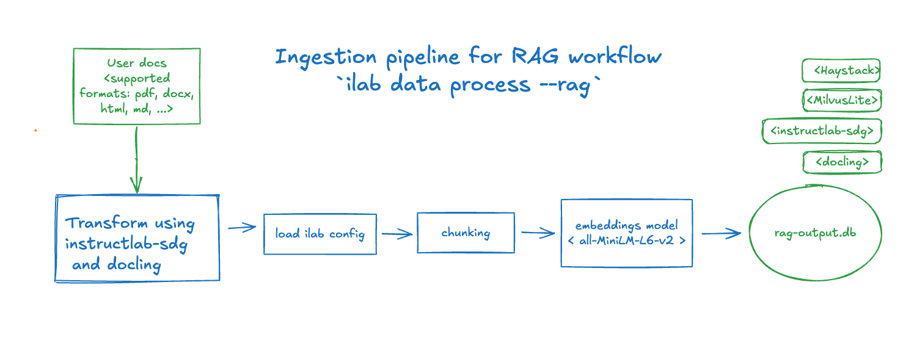
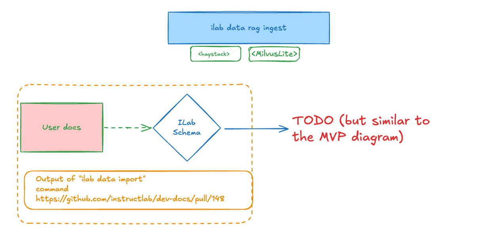

# Ingesting and Utilizing RAG Artifacts Design Proposal

**Author**: Daniele Martinoli

**Version**: 0.1 (intentionally "naked" until we agree on the high-level design)

## 1. Introduction
Goal is to describe how we can extend the InstructLab CLI to include options to ingest a local RAG from pre-processed customer documentation, that we assume to be generated from docling output.

References:<br/>
**They will be removed later as they can't stay in a public repo**
* [RAG Artifacts with RHEL AI](https://docs.google.com/document/d/1nALKAawvvNKlTnbeQIXmpIXbo2Lxm2vIw1euxW96TgE)
* [Productization RHEL AI RAG Atifacts](https://docs.google.com/document/d/13lU1bKlqmihEyZDcYCnv4fiv4WUKFELNRXucDgm1d9M)

## 2. Use Case
TODO

## 3. Proposed Commands
### 3.1 RAG Ingestion Pipeline Command
The proposal is to add a `rag` subgroup under the `data` group, with an `ingest` command, like:
```
ilab data rag ingest DOCS
```

#### Command Purpose
This command processes embeddings generated from documents located in the *DOCS* folder and stores them in a vector database. These embeddings are intended to be used as augmented context in a Retrieval-Augmented Generation (RAG) chat pipeline.

#### Assumptions
The documents must be in JSON format and pre-processed using the docling tool.
**TODO** what exact schema we expect and to document how to generate these formatted documents

#### Supported Databases
The command supports multiple vector database types. By default, it uses a local `MilvusLite` instance stored at `./rag-output.db`.

#### Usage
The generated embeddings can later be retrieved to enrich the context for RAG-based chat pipelines.

### 3.2 RAG Ingestion Pipeline Options
| Option full name | Description | Default | CLI option |
|------------------|-------------|---------|------------|
| rag.splitter.split_by | One of `page`, `passage`, `sentence`, `word`, `line` | `word` | `--split-by` |
| rag.splitter.split_length | The maximum number of units in each split | `200` | `--split-length` |
| rag.splitter.split_overlap | The number of overlapping units for each split | `0` | `--split-overlap` |
| rag.splitter.split_threshold | The minimum number of units per split | `0` | `--split-threshold` |
| The vector DB implementation, one of: milvuslite, milvus, ... | `milvuslite` | `--vectordb-type` |
| rag.vectordb.type | The vector DB implementation, one of: milvuslite, milvus, ... | `milvuslite` | `--vectordb-type` |
| rag.vectordb.uri | The vector DB service URI | `./rag-output.db` | `--vectordb-uri` |
| rag.vectordb.token | The vector DB connection token | | `--vectordb-token` |
| rag.vectordb.username | The vector DB connection username | | `--vectordb-username` |
| rag.vectordb.password | The vector DB connection password | | `--vectordb-password` |
| rag.embedding_model.name | The embedding model name | `sentence-transformers/all-minilm-l6-v2` | `--model` |
| rag.embedding_model.token | The token to download private models | | `--model-token` |
| **TODO** evaluation framework options | | | |

### 3.3 RAG Chat Pipeline Command
The proposal is to add a `rag` option under the `model chat` command, like:
```
ilab model chat --rag
```
#### Command Purpose
This command enhances the existing `ilab model chat` functionality by integrating contextual information retrieved from user-provided documents, enriching the conversational experience with relevant insights.

### 3.4 RAG Chat Pipeline Options
Notes:
* All the `rag.vectordb.*` options previously defined are also used to locate the vector DB.
* 

| Option full name | Description | Default | CLI option |
|------------------|-------------|---------|------------|
| chat.rag.retriever.top_k | The maximum number of documents to retrieve | `10` | `--retriever-top-k` |
| chat.rag.retriever.min_score_threshold | The minimum score threshold for chunks to be considered | `0.5` | `--retriever-min-score-threshold` |
| chat.rag.retriever.filters | Comma separated key-value pairs filters to restrict the search space | | `--retriever-filters` |
| chat.rag.prompt | Prompt template for RAG-based queries | See **Notes** | `--rag-prompt` |

**Notes**:
* Example of `filters` for a `milvuslite` DB:
```
--retriever-filters "url=https://en.wikipedia.org/wiki/Mausoleum_at_Halicarnassus"
```
which translates to the following dictionary in the retrieval request (*):
```json
{
  'operator': '==',
  'field': 'url',
  'value': 'https://en.wikipedia.org/wiki/Mausoleum_at_Halicarnassus'
}
```
(*) This is for `milvuslite`, other DB can have a different implementation

* Example of default RAG prompt:
```python
"""
Given the following information, answer the question.

Context:
{{context}}

Question: {{question}}
Answer:
"""
```

### 3.5 References
* [Haystack-DocumentSplitter](https://github.com/deepset-ai/haystack/blob/f0c3692cf2a86c69de8738d53af925500e8a5126/haystack/components/preprocessors/document_splitter.py#L55)
* [MilvusEmbeddingRetriever](https://github.com/milvus-io/milvus-haystack/blob/77b27de00c2f0278e28b434f4883853a959f5466/src/milvus_haystack/milvus_embedding_retriever.py#L18)


### 3.5 Workflow Visualization
<!-- https://excalidraw.com/#json=XOQDPUR1geqsDvJxlIxjA,gf7kQirzFzG1vZr7kg0Gdw -->
Ingestion pipeline:

Chat pipeline enriched by RAG context:


### 3.6 Proposed Implementation Stack
The following technologies form the foundation of the proposed solution:

* [Haystack](https://haystack.deepset.ai/): Framework for implementing RAG pipelines and applications.
* [MilvusLite](https://milvus.io/docs/milvus_lite.md): The default vector database for efficient storage and retrieval of embeddings.
* [Docling](https://github.com/DS4SD/docling): Document processing tool. For more details, refer to William’s blog, [Docling: The missing document processing companion for generative AI](https://www.redhat.com/en/blog/docling-missing-document-processing-companion-generative-ai).
[Ragas](https://docs.ragas.io/en/latest/concepts): Framework for evaluating and optimizing retrieval-augmented generation pipelines.

## 4. Future Enhancements
### 4.1 Integrate the Knowledge Document Ingestion Pipeline
Integrate the RAG ingestion pipeline with the [Knowledge Document Ingestion Pipeline](https://github.com/instructlab/dev-docs/pull/148):


### 4.2 Fine-Tuning of Text Embedding Model
**TODO**

### 4.3. Agentic RAG and Advanced Retrieval artifacts
**TODO**
...
